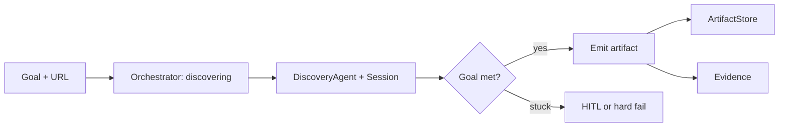
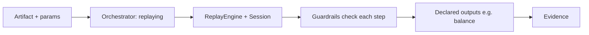
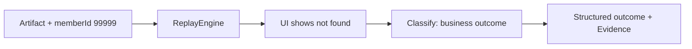
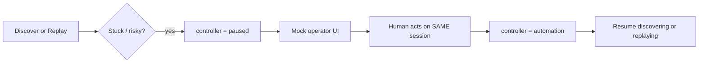

# Working Notes — Computer-Use Automation System

**Source brief:** Assignment A — Computer-Use Automation System  
**Repo:** `interface-ai-computer-use-assignment`  
**Git home:** this checkout (public remote intended: `Harshil-V/interface-ai-computer-use-assignment`)  
**Status:** Planning notes only — nothing implemented yet  
**Date:** 2026-08-13

---

## 1. Context / one-liner

Build a system that lets an LLM **discover** how to use a legacy UI once, **save** a reusable capability artifact, then **replay** it deterministically (no LLM), with safety rails and human takeover on the **same live session**.

| | |
|---|---|
| Product fit | interface.ai bank / CU agent “hands” layer |
| In scope | UI discovery → artifact → deterministic replay → HITL → guardrails → evidence |
| Out of scope | Real bank APIs, real PII/credentials, multi-tenant infra |

**Decided:** This is the UI automation layer, not the banking backend.

---

## 2. Two-part project split

**Decided**

| Part | What | Role |
|------|------|------|
| **A** | Local mock target — mini “Core Banking Console” | Playground stand-in: real UI, fake data |
| **B** | Automation system | Assignment core: goal → discover → artifact → replay → HITL → guardrails → evidence |

Part A exists so Part B has something real to click. Part B is what gets graded.

---

## 3. Part A — Core Banking Console (mock app)

**Decided:** Fake Core Banking Console as the only target for demos.

### Screens

| Screen | Notes |
|--------|--------|
| Login | **Decided: cut.** No auth screen — see session model below for why login isn't needed to cover session-timeout |
| Member lookup | Form → results table |
| Member detail | Shows savings balance |
| Open sub-account | **Decided: in scope.** Multi-field form → confirmation — the real irreversible-action screen guardrails/HITL key off |

### Session model (**Decided**)

No login screen. Instead: a lightweight in-memory session token is issued on first load of the console. After N seconds idle (config constant, also force-expirable via a test hook for reliable demos), member-detail and sub-account screens return a "session expired" state instead of data — a real, non-injected way to produce the **session timeout** exceptional state that §3.3 names explicitly, without the cost of a full auth flow.

### Built-in cases

| Input | Expected |
|-------|----------|
| Member `12345` | Exists; balance e.g. **$1,240.55** |
| Member `67890` | Exists; balance **$84,302.19** — second valid member, distinct balance shape, used to prove replay parameterizes on `memberId` rather than being baked to one recorded value |
| Member `99999` | Not found → **business outcome** (not a crash) |
| Empty search | Validation error |
| Idle past timeout | Session expired → **recoverable** condition (re-establish session, retry) |

### Constraints

- UI = real components (scan / find / click)
- Data = fake only
- No real bank systems, no real PII/credentials

---

## 4. Part B — Core requirements map (brief §§3.1–3.7)

| § | Topic | Working interpretation |
|---|--------|-------------------------|
| 3.1 | Agent loop | Discover: LLM + browser tools until goal satisfied or stuck |
| 3.2 | Artifact | Versioned, reusable capability (steps + locators + I/O), no secrets/transcripts |
| 3.3 | Deterministic replay | No LLM; typed params; error taxonomy below |
| 3.4 | Safety | Allowlist of actions/URLs; redact secrets in logs/evidence |
| 3.5 | Evidence | Screenshots / step logs / outcome under `/evidence/` |
| 3.6 | HITL | Same-session handoff; mock operator UI OK |
| 3.7 | Heterogeneity / multi-tenant | **Design-only in REPORT.md** — do not build infra |

### Replay error taxonomy (**Decided**)

| Class | Meaning | Example |
|-------|---------|---------|
| **Business outcome** | Expected domain result, not a system failure | Member `99999` not found |
| **Recoverable** | Transient / soft failure; may retry or HITL | Locator miss, timeout |
| **Hard failure** | Unrecoverable without redesign | Allowlist violation, crashed session |

---

## 5. Recommended architecture

**Decided:** One process, one Playwright browser session/context per run, three modes.

### Modes

```
discovering | replaying | human
```

### Controller enum (session ownership)

```
automation | human | paused
```

### Component map

| Component | Responsibility |
|-----------|----------------|
| **Orchestrator** | Mode switches, run lifecycle, wires everything |
| **DiscoveryAgent** | LLM loop; proposes actions; emits artifact on success |
| **ReplayEngine** | Loads artifact; executes steps deterministically |
| **Session** | Playwright browser context; shared across discover / replay / HITL |
| **Guardrails** | Allowlist, redaction, step limits |
| **ArtifactStore** | Persist / load versioned JSON artifacts |
| **Evidence** | Screenshots, logs, run folder under `/evidence/` |
| **Handoff** | Mock operator page; pause / intervene / resume |

### Tech lean (**Decided**)

| Choice | Why |
|--------|-----|
| Playwright | Browser automation; headed for watchability |
| Accessibility tree (+ DOM fallback) | Stable locators for discovery & replay |
| Versioned JSON artifact | Simple, reviewable, no DB required |
| Mock operator page | HITL without a full co-browse console |

### Tech stack (**Decided**)

| Part | Stack |
|------|--------|
| **A** | Vite + minimal React (or static HTML) + JSON mock data |
| **B** | TypeScript + Playwright + LLM SDK + JSON artifacts + tiny HITL page + CLI |

---

## 6. Repo folder structure

**Decided:** Flat layout — `mock-console/` + `automation/` at repo root (simpler for take-home).

```
interface-ai-computer-use-assignment/
├── README.md
├── REPORT.md
├── package.json                 # optional workspace root
├── .env.example
├── docs/
│   └── 2026-08-13-computer-use-automation-notes.md
├── mock-console/                # Part A — Core Banking Console
├── automation/                  # Part B — Automation system
│   └── (cli, orchestrator, discovery, replay, session, guardrails, artifact, handoff, evidence helpers, operator-ui, config)
├── artifacts/                   # saved capability JSON
└── evidence/                    # discovery + replay deliverable runs
```

### Folder → Part → role

| Folder | Part | Role |
|--------|------|------|
| `mock-console/` | A | Local Core Banking Console (target UI + fake data) |
| `automation/` | B | Discovery, replay, session, guardrails, HITL, CLI, evidence helpers |
| `artifacts/` | B (output) | Saved versioned capability JSON |
| `evidence/` | B (output) | Discovery + replay run screenshots / logs |
| `docs/` | — | Planning notes (this file) |
| `README.md` / `REPORT.md` | — | Setup/demo path + required report |

### Import / boundary rule (**Decided**)

- **Part A never imports Part B.**
- **Part B talks to Part A only over HTTP via Playwright** (no shared runtime coupling).

### Optional alternative (not default)

A nested monorepo layout (`apps/mock-console` + `packages/automation`) is fine if a workspace root becomes useful later. **Decided default = flat** `mock-console/` + `automation/` for take-home simplicity.

---

## 7. Live session / visibility

**Decided**

| Concern | Approach |
|---------|----------|
| Watch runs | Headed browser |
| HITL | Mock operator page + real pause/resume on **same** Playwright session |
| Full co-browse console | **OUT OF SCOPE** |

### Intervention payload (sketch)

| Field | Purpose |
|-------|---------|
| `runId` | Correlate evidence / operator UI |
| `step` | Where automation stopped |
| `reason` | Why handoff was requested |
| `screenshot` / context | Operator situational awareness |

---

## 8. Inputs / outputs

### Discovery

| Input | Notes |
|-------|--------|
| Goal (natural language) | e.g. “Look up member balance” |
| Target URL | Local Core Banking Console |
| Config | Allowlist, model, timeouts, etc. |

**Output:** Capability artifact (+ evidence of the discovery run)

### Replay

| Input | Notes |
|-------|--------|
| Artifact | Loaded from store |
| Typed params | e.g. `memberId: "12345"` |

**Output:** Declared fields (e.g. `balance`) **or** structured business outcome

**Decided:** Real UI interaction; mock/sandbox data only.

---

## 9. End-to-end flows

### 9.1 Happy discovery → artifact



### 9.2 Replay success



### 9.3 Replay not-found (business outcome)



Ascii (same idea):

```
artifact + 99999 → replay steps → "not found" UI
  → NOT hard failure → business_outcome payload → evidence/
```

### 9.4 Stuck → HITL → resume



### 9.5 Vertical slice (from brief — keep this thread alive)

One thin path that proves the whole story:

1. Start local Core Banking Console  
2. Discover: “Get savings balance for a member” against `12345`  
3. Save artifact  
4. Replay with `12345` → balance  
5. Replay with `99999` → business outcome  
6. Force a stuck case → HITL pause → human click → resume  
7. Drop evidence folder + demo path in README  

---

## 10. Frozen demo scenarios

**Decided** — freeze these for README / grading path.

| # | Scenario | Mode | Input | Expected |
|---|----------|------|-------|----------|
| 1 | Discover capability | discovering | Goal + console URL | Artifact written; evidence of steps |
| 2 | Replay success | replaying | Artifact + `12345` | Balance ≈ `$1,240.55` |
| 3 | Replay not found | replaying | Artifact + `99999` | Business outcome (not found) |
| 4 | Validation | replaying or UI | Empty search | Validation error surfaced / handled |
| 5 | Session timeout | replaying | Idle past expiry, then `12345` | Recoverable: session expired detected, re-established / retried |
| 6 | HITL — stuck | discovering or replaying | Forced dead-end step | `controller = paused` → mock operator → resume same session |
| 7 | HITL — risky action | replaying | Open sub-account confirmation step | Guardrail flags irreversible step → `controller = paused` → human confirms → resume |

---

## 11. Artifact contract sketch

**Decided:** Versioned JSON; no secrets; no LLM transcripts.

Field sketch (not a final formal schema):

```json
{
  "id": "string",
  "version": "semver or int",
  "title": "string",
  "description": "string",
  "inputs": [{ "name": "memberId", "type": "string", "required": true }],
  "outputs": [{ "name": "balance", "type": "string" }],
  "steps": [
    {
      "action": "click | fill | select | wait | assert | ...",
      "locator": { "strategy": "role|label|css|...", "value": "..." },
      "params": {}
    }
  ],
  "checkpoint": "optional success predicate / final assert",
  "outcomes": [
    { "id": "not_found", "when": "...", "type": "business_outcome" }
  ]
}
```

| Include | Exclude |
|---------|---------|
| Stable locators, typed I/O, optional named outcomes | Secrets, credentials, full chat transcripts, raw model dumps |

**Open:** Exact JSON schema / validation details (see §15).

---

## 12. Order of work (phased checklist)

Logical build order — tick as you go.

| # | Phase | Notes |
|---|-------|--------|
| 1 | Notes / doc | **This file** |
| 2 | Part A local console | Minimal screens + fake data (`12345` / `99999` / empty) |
| 3 | Session + guardrails skeleton | Playwright context, allowlist, redaction hooks |
| 4 | Discovery loop | One real LLM run against Part A |
| 5 | Artifact emit / schema | Write + load versioned JSON |
| 6 | Deterministic replay + error taxonomy | Business / recoverable / hard |
| 7 | HITL pause / resume | Mock operator + same-session handoff |
| 8 | Evidence folder + README demo path | `/evidence/` + copy-pasteable demo |
| 9 | `REPORT.md` | Seven required headings |
| 10 | Optional stretch | Pick **at most one** |

Do not start stretch until 1–9 are demoable.

---

## 13. Explicit cuts / non-goals

**Decided — do not build**

| Cut | Rationale |
|-----|-----------|
| Job queues / workers | Overkill for take-home |
| Multi-tenant infra | Design-only in REPORT |
| Full operator / co-browse console | Mock page is enough |
| Desktop (non-browser) automation | Brief allows web focus |
| Open-ended LLM recovery on replay | Replay stays deterministic |
| Real bank data / credentials / PII | Fake console only |
| Production auth / SSO | Optional fake login at most |
| Multi-browser fleet | One headed session per run |

---

## 14. Deliverables reminder

| Deliverable | Notes |
|-------------|--------|
| Public GitHub repo | Assignment submission surface |
| `README.md` | Setup + demo path for scenarios in §10 |
| `REPORT.md` | **Seven headings** required by the brief |
| `/evidence/` | Screenshots / logs / run artifacts |
| Email | `assignments@interface.ai` |

Cross-check every deliverable against **Assignment A — Computer-Use Automation System** before sending.

---

## 15. Open questions / still to freeze

| # | Question | Status | Lean |
|---|----------|--------|------|
| 1 | Exact artifact JSON schema (required fields, locator shape, outcome encoding) | **Open** | Start from §11 sketch; freeze after first discovery emit |
| 2 | Login in v1 Part A? | **Decided** | Cut. Session-timeout instead covered by a lightweight in-memory session + idle expiry, no auth screen — see §3 |
| 3 | Stretch goal (pick ≤1) | **Open** | Choose after vertical slice works |
| 4 | LLM provider / model for discovery | **Open** | Whatever is fastest to wire with tool-calling |
| 5 | Part A stack (plain HTML vs small React/Vite app) | **Decided** | Vite + minimal React (or static HTML) + JSON mock data — see §5 |
| 6 | How “risky” steps trigger HITL automatically vs manual force for demo | **Open** | Force for demo reliability; optional auto rules later |
| 7 | Artifact store location (repo folder vs runtime dir) | **Decided** | Repo `artifacts/` folder (see §6); evidence under `evidence/` |
| 8 | Repo folder layout (flat vs apps/packages monorepo) | **Decided** | Flat `mock-console/` + `automation/` — see §6 |

---

## Quick reference — decisions already locked

- Two-part split: mock console (A) + automation system (B)
- Flat repo: `mock-console/` + `automation/` (+ `artifacts/`, `evidence/`); A ↛ B imports; B↔A over HTTP/Playwright only
- Tech: A = Vite + minimal React (or static HTML) + JSON mocks; B = TypeScript + Playwright + LLM SDK + JSON artifacts + tiny HITL + CLI
- Target cases: `12345`, `99999`, empty validation, idle session timeout
- No login screen; session-timeout covered by lightweight in-memory session + idle expiry instead
- Sub-account open flow is in scope (not cut) — real irreversible action for guardrails/HITL
- One process / one Playwright session per run
- Modes: discovering | replaying | human
- Controller: automation | human | paused
- HITL = mock operator + same session; no full co-browse
- Replay error taxonomy: business / recoverable / hard
- Multi-tenant / heterogeneity = REPORT design only
- Planning notes only as of this doc — no implementation claimed
